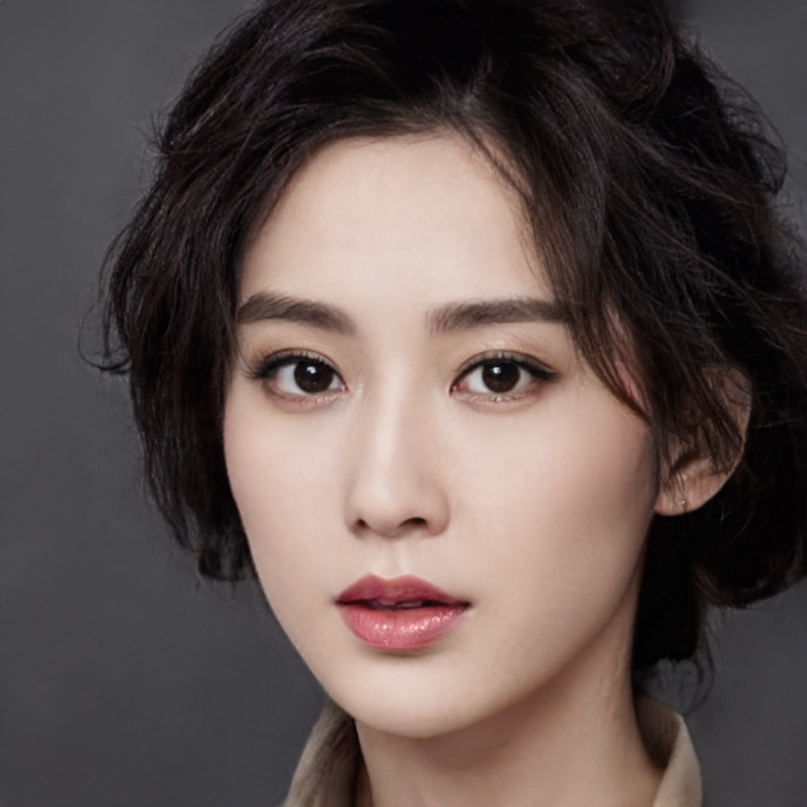

---

---

<h1 id="🧠-yu-hui-chang-coco">🧠 YU-HUI CHANG (Coco)</h1>

<strong>AI Product Manager | Bilingual | Creative Technologist</strong> 
📍 Taoyuan, Taiwan ｜📞 0975-569-645 ｜✉️ <a href="mailto:q4266213coco@gmail.com">q4266213coco@gmail.com</a>

  

<h2 id="📝-about-me">📝 About Me</h2>

With hands-on experience in NLP and generative AI, I enjoy turning “what if” ideas into real products that people actually find useful and fun. 
Working in a bilingual environment every day, I’m comfortable switching between Mandarin and English to collaborate across teams and cultures.

I have a genuine interest in AI and product design, and I like keeping up with new trends—not just for work, but because learning new things is something I truly enjoy. 
I’m naturally curious, love chatting with teammates to exchange ideas, and often gather different perspectives to help shape better and more thoughtful products.

<h2 id="🔧-skills">🔧 Skills</h2>

<table>
<thead>
<tr>
<th>Category</th>
<th>Skills</th>
</tr>
</thead>
<tbody>
<tr>
<td>Product &amp; Collaboration</td>
<td>Agile Development, User-Centered Design, Cross-Functional Communication</td>
</tr>
<tr>
<td>AI &amp; Programming</td>
<td>Python, PyTorch, Hugging Face Transformers, NLP, Generative AI</td>
</tr>
<tr>
<td>Tools</td>
<td>Git, GitHub, Google Workspace, Notion, Figma</td>
</tr>
<tr>
<td>Languages</td>
<td>Mandarin (Native), English (Fluent)</td>
</tr>
</tbody>
</table>

<h2 id="💼-professional-experience">💼 Professional Experience</h2>
<h3 id="ai-engineer">AI Engineer</h3>

<strong>Confidential Company</strong> ｜ <em>Aug 2024 – Feb 2025</em>

<ul>
<li>Built internal ChatGPT-powered APIs to improve customer and team workflows</li>
<li>Developed and fine-tuned NLP models for classification and retrieval tasks</li>
<li>Collaborated with designers and PMs to implement AI tools into product prototypes</li>
</ul>
<h3 id="science--english-instructor">Science &amp; English Instructor</h3>

<strong>Stonebooks Education Studio</strong> ｜ <em>Dec 2021 – Present</em>

<ul>
<li>Designed personalized English and STEM courses for students aged 7–15</li>
<li>Integrated AI-powered tools (e.g., grammar bots) to enhance learning</li>
<li>Communicated with parents and tracked academic progress</li>
</ul>
<h3 id="swimming-instructor-certified">Swimming Instructor (Certified)</h3>

<strong>Freelance</strong> ｜ <em>2016 – 2020</em>

<ul>
<li>Taught beginner to advanced-level swimming across all age groups</li>
<li>Adjusted techniques based on individual comfort levels and feedback</li>
<li>Built strong observation and empathy skills—core to my user-centered mindset</li>
<li><strong>Certification</strong>: Swimming Instructor License</li>
</ul>

<h2 id="🧪-projects">🧪 Projects</h2>
<h3 id="predicting-post-intervention-outcomes-with-deep-learning">Predicting Post-Intervention Outcomes with Deep Learning</h3>

<strong>Master’s Thesis, National Taiwan University</strong>

<ul>
<li>Developed a CNN-based model using preoperative CZT-SPECT myocardial perfusion images</li>
<li>Predicted improvements in coronary intervention (PCI) with interpretable results (Grad-CAM)</li>
<li>Contributed to personalized treatment planning in cardiovascular care</li>
</ul>

<h2 id="🎓-education">🎓 Education</h2>

<strong>National Taiwan University, Taiwan</strong> 
<em>Master of Science in Biomedical Engineering</em> ｜ Sep 2019 – Jun 2023

<ul>
<li>Focus: Medical image analysis, deep learning, AI model development</li>
<li>Thesis applied machine learning to real-world healthcare prediction tasks</li>
</ul>

<h2 id="📎-contact">📎 Contact</h2>
<ul>
<li><strong>Email</strong>: <a href="mailto:q4266213coco@gmail.com">q4266213coco@gmail.com</a></li>
<li><strong>Phone</strong>: 0975-569-645</li>
<li><strong>Location</strong>: Taoyuan, Taiwan</li>
<li><strong>LinkedIn / GitHub / Portfolio</strong>: <em>[Add links here]</em></li>
</ul>

