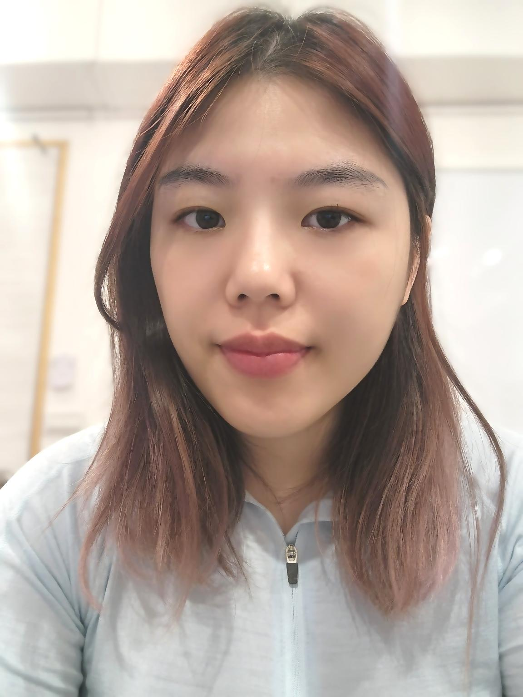
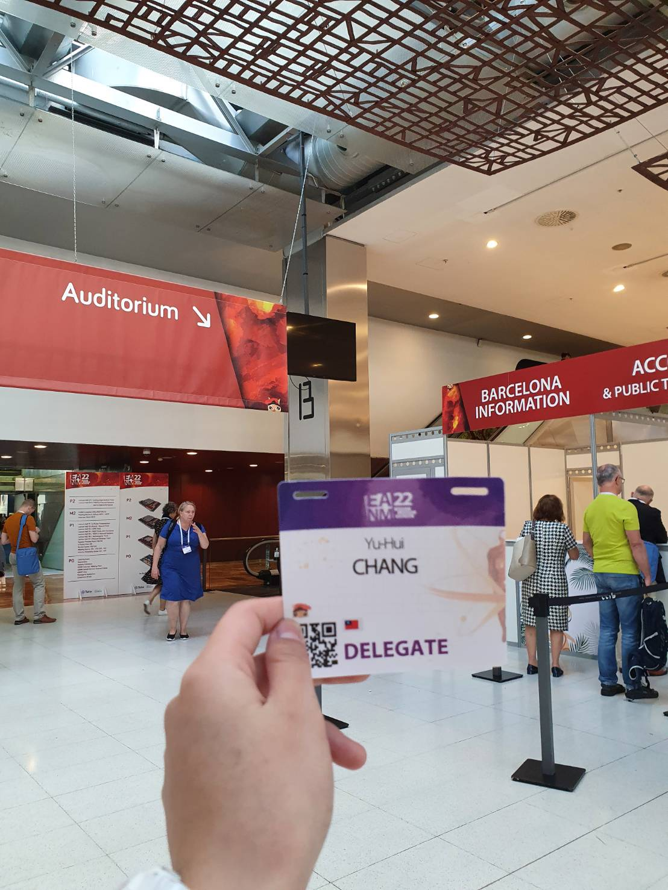

---

  <table style="border: none;">
    <tr>
      <td style="vertical-align: middle; padding-right: 20px;">
        <h1>🧠 YU-HUI CHANG (Coco)</h1>
        
<strong>AI Product Manager | Bilingual | Creative Technologist</strong>

        
📠Taoyuan, Taiwan ｜ 📠0975-569-645 ｜ âœ‰ï¸ <a href="mailto:q4266213coco@gmail.com">q4266213coco@gmail.com</a>

      </td>
      <td style="vertical-align: middle;">
        
      </td>
    </tr>
  </table>

<h2 id="📝-about-me">📝 About Me</h2>

With hands-on experience in NLP and generative AI, I enjoy turning “what if†ideas into real products that people actually find useful and fun. 
Working in a bilingual environment every day, I’m comfortable switching between Mandarin and English to collaborate across teams and cultures.

I have a genuine interest in AI and product design, and I like keeping up with new trends—not just for work, but because learning new things is something I truly enjoy. 
I’m naturally curious, love chatting with teammates to exchange ideas, and often gather different perspectives to help shape better and more thoughtful products.

<h2 id="🔧-skills">🔧 Skills</h2>

<table>
<thead>
<tr>
<th>Category</th>
<th>Skills</th>
</tr>
</thead>
<tbody>
<tr>
<td>Product &amp; Collaboration</td>
<td>Agile Development, User-Centered Design, Cross-Functional Communication</td>
</tr>
<tr>
<td>AI &amp; Programming</td>
<td>Python, PyTorch, Hugging Face Transformers, NLP, Generative AI</td>
</tr>
<tr>
<td>Tools</td>
<td>Git, GitHub, Google Workspace, Notion, Figma</td>
</tr>
<tr>
<td>Languages</td>
<td>Mandarin (Native), English (Fluent)</td>
</tr>
</tbody>
</table>

<h2 id="💼-professional-experience">💼 Professional Experience</h2>
<h3 id="ai-engineer">AI Engineer</h3>

<strong>Confidential Company</strong> ｜ <em>Aug 2024 – Feb 2025</em>

<ul>
<li>Built internal ChatGPT-powered APIs to improve customer and team workflows</li>
<li>Developed and fine-tuned NLP models for classification and retrieval tasks</li>
<li>Collaborated with designers and PMs to implement AI tools into product prototypes</li>
</ul>
<h3 id="science--english-instructor">Science &amp; English Instructor</h3>

<strong>Stonebooks Education Studio</strong> ｜ <em>Dec 2021 – Present</em>

<ul>
<li>Designed and delivered personalized English and STEM courses for students from elementary to high school</li>
<li>Emphasized logic-based teaching with a focus on math and science subjects, blending structured instruction with interactive discussion</li>
<li>Communicated closely with parents to monitor academic progress and adapt teaching strategies accordingly</li>
</ul>
<h3 id="swimming-instructor-certified">Swimming Instructor (Certified)</h3>

<strong>Freelance</strong> ｜ <em>2016 – 2020</em>

<ul>
<li>Taught beginner to advanced-level swimming across all age groups</li>
<li>Adjusted techniques based on individual comfort levels and feedback</li>
<li>Built strong observation and empathy skills—core to my user-centered mindset  </li>
<li><strong>Certification</strong>: Swimming Instructor License</li>
</ul>

<h2 id="🧪-projects">🧪 Projects</h2>
<h3 id="predicting-post-intervention-outcomes-with-deep-learning">Predicting Post-Intervention Outcomes with Deep Learning</h3>

<strong>Master’s Thesis, National Taiwan University</strong>

<ul>
<li>Developed a CNN-based model using preoperative CZT-SPECT myocardial perfusion images</li>
<li>Predicted improvements in coronary intervention (PCI) with interpretable results (Grad-CAM)</li>
<li>Contributed to personalized treatment planning in cardiovascular care</li>
</ul>

<h2 id="🎓-education">🎓 Education</h2>

<strong>National Taiwan University, Taiwan</strong> 
<em>Master of Science in Biomedical Engineering</em> ｜ Sep 2019 – Jun 2023

<ul>
<li>Focus: Medical image analysis, deep learning, AI model development</li>
<li>Thesis applied machine learning to real-world healthcare prediction tasks</li>
</ul>

<h2 id="🎤-conference-presentation"> Conference Presentation</h2>
<h3>EANM 2022 – European Association of Nuclear Medicine Annual Congress</h3>

<strong>📠Barcelona, Spain ｜ ğŸ—“ï¸ October 2022</strong>

<ul>
  <li>Delivered an oral presentation on my research project related to AI-driven myocardial perfusion imaging using CZT-SPECT</li>
  <li>Presented an e-poster showcasing a deep learning model designed to predict improvements after coronary intervention</li>
  <li>Interacted with international researchers and medical professionals, discussing technical insights and clinical applications</li>
  <li>Strengthened public speaking and cross-cultural communication skills in a high-level academic setting</li>
  
📄 <a href="profile/images/Attendance_Certificate_YChang_1.pdf" target="_blank">
  Certificate of Attendance – EANM 2022 (PDF)
</a>

</ul>

  

<h2 id="📎-contact">📎 Contact</h2>
<ul>
<li><strong>Email</strong>: <a href="mailto:q4266213coco@gmail.com">q4266213coco@gmail.com</a></li>
<li><strong>Phone</strong>: 0975-569-645</li>
<li><strong>Location</strong>: Taoyuan, Taiwan</li>
</ul>

